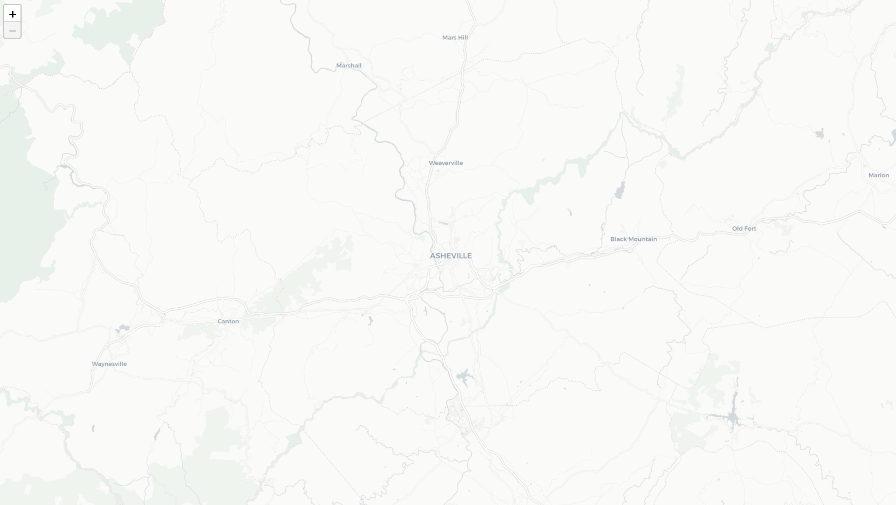
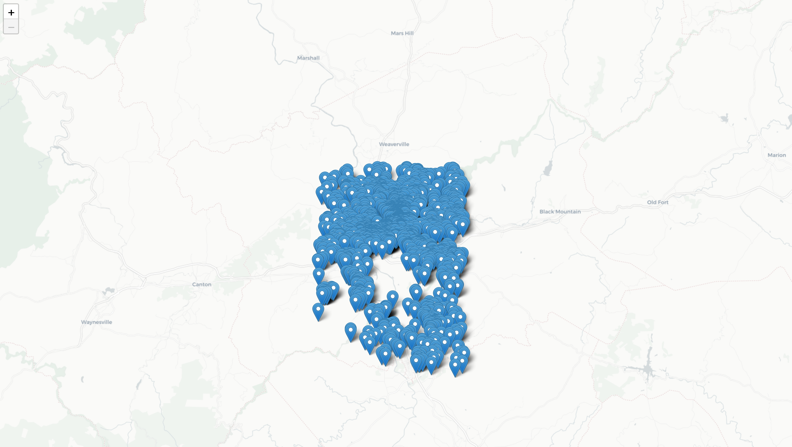
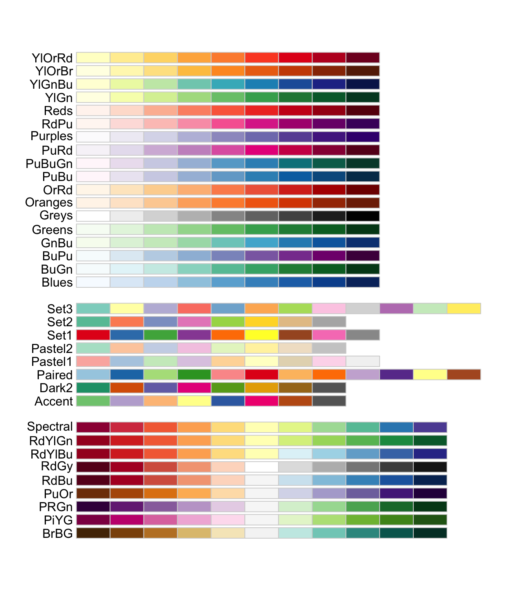

# Lab 3: Thematic Web Map Design

> Note this is a two-part lab. In part one, you will walk through demonstration steps to create an interactive web map. In part two, you will be asked to create your own interactive web map. Both parts require products for submission on the lab due date. You may wish to scroll to the end section and review the deliverables for this lab.

## Part 1

In this lab, we will design an interactive web map of Airbnbs in Buncombe County, NC. One of the key components of web map design is styling your elements to provide proper symbolization for your data. This increases accessibility for readers and can give your map an appealing sense of aesthetics. Map elements can be customized to include thematic layers (i.e., points, lines, and polygons), base maps (as a leaflet `tileLayer`), interactive features (the components of the map that allow for user interaction), and legends and supplemental information (such as credits, etc.). To get started, two GeoJSON files are available on the course ASULearn page: (1) Buncombe county Airbnbs, which are from [Inside Airbnb](http://insideairbnb.com/get-the-data.html), and Buncombe county Zoning Districts from [City of Asheville Open Data Portal](https://data-avl.opendata.arcgis.com/datasets/c22b353722b14d02bb06b23cd1bedf60_9?geometry=-82.760%2C35.549%2C-82.346%2C35.647). Note that I downloaded theses files as shapefiles and converted them to GeoJSON format using the QGIS conversion process we have discussed previously. To get started, download these files to your directory for this lab and then preview the final web map at the URL below.

You should organize your directory as follows:

```powershell
[your_directory/repository_name]
    │index.html
    ├─assets
    │      [name of your data file].geojson
    │      [name of your data file].geojson
```

[Final Web Map Example for Part 1](https://suggjw.github.io/Airbnb_map)

## 1. Set up the Map and Add Data

In your IDE (Atom), create a new file `lab3_map1.html` to prepare for editing.

This file is a basic HTML page. The sample code for a basic HTML page is listed below for copying into your file.

Inside the `head` tag, we include both the latest version of `leaflet.css` and `leaflet.js`. After the `leaflet.css` we add a `style` tag in order to include our customized CSS styling codes.

Inside the `body` tag, we put a `map` div tag for holding the map object. After that map `div` tag, we include a `script` tag to put the javascript codes.

> Remember, our scripts are case senstive. The details matter and must be copied verbatim.

```html
<!DOCTYPE html>
<html>
<head>
    <meta charset="UTF-8">
    <title>Buncombe County Airbnbs (2020)</title>
    <link rel="stylesheet" href="https://unpkg.com/leaflet@1.7.0/dist/leaflet.css"/>
    <style>

    </style>
    <script src="https://unpkg.com/leaflet@1.7.0/dist/leaflet.js"></script>
</head>
<body>
<!-- Our web map and content will go here -->
<div id="map"></div>
<script>

</script>
</body>
</html>
```

**Full screen styling**

To expand the map to the full screen, we set the width and height of `html`, `body` and `#map` as `100%`, and no margin, background color as white.

The following line goes in your HTML file between the CSS style tags that you just created above.

```css
html, body, #map { width: 100%; height: 100%; margin: 0; background: #fff; }
```

**The Script**

Inside the `script` tag,  we create a `mymap` variable to hold the leaflet map object. The first parameter of `L.map` object `'map'` is the `id` of the div to hold the map object.

Next, we add a `tileLayer` to add a base map to the `mymap` variable.

```js
// 1. Create a map object.
var mymap = L.map('map', {
    center: [35.5946,-82.5540], //note that we've centered the map to downtown AVL
    zoom: 11, //this line adjusts the starting zoom level of the map
    maxZoom: 18,//this line sets the maximum zoom level
    minZoom: 11,//this line sets the minimum zoom level
    detectRetina: true // detect whether the sceen is high resolution or not.
});

// 2. Add a base map.
L.tileLayer('http://{s}.basemaps.cartocdn.com/light_all/{z}/{x}/{y}.png').addTo(mymap);
```

Now we will open up Atom live server, and then navigate to your saved ``lab3_map1.html``. Remember from lecture 3 that we can launch the live server by using `Ctrl` + `Alt` + `l` (`Ctrl` + `Option` + `l` on Mac) in  Atom's main window. The url address of lab3_map1.html should be `https://localhost:3000/lab3_map1.html`, or something similar based on how you have structured your directory.

As a rule of thumb, you need to remember when the server is live and when it is not. When you make and save changes to your HTML file, the browser should automatically apply those changes over the live server, which will show you the result. To close the live server, remember that you can use `Ctrl` + `Alt` + `q` (`Ctrl` + `Option` + `q` on Mac).



The base map (in the format of `tile layer`) is provided by CartoDB. The light colored basemap is simple and clean, and will make principal features stand out. If you would like to experiment with other base map providers, please refer to [Leaflet providers](http://leaflet-extras.github.io/leaflet-providers/preview/). As you toggle through the options, you will see that plain JS code is provided, which you would add to your HTML code like the following example.

```js
// 2. Add a base map.
var Stamen_Watercolor = L.tileLayer('https://stamen-tiles-{s}.a.ssl.fastly.net/watercolor/{z}/{x}/{y}.{ext}', {
  attribution: 'Map tiles by <a href="http://stamen.com">Stamen Design</a>, <a href="http://creativecommons.org/licenses/by/3.0">CC BY 3.0</a> &mdash; Map data &copy; <a href="https://www.openstreetmap.org/copyright">OpenStreetMap</a> contributors',
  subdomains: 'abcd',
  minZoom: 1,
  maxZoom: 16,
  ext: 'jpg'
}).addTo(mymap);
```

This is only an example using the ``Stamen.Watercolor`` base map. In our exercise, we will continue with the original 'light_all' base map from CartoDB in our HTML file.


**Add Airbnb Data**

Next, we will add the Airbnb data set to the map. First, we need to include another Javascript library [leaflet.ajax](https://github.com/calvinmetcalf/leaflet-ajax) in the `head` element. This library will be used to asynchronously read `GeoJSON` data.

Add this line to the `<head>` section of your HTML code beneath the line with the `<script>` tag you used to load the Leaflet library.

```html
<script src="https://cdnjs.cloudflare.com/ajax/libs/leaflet-ajax/2.1.0/leaflet.ajax.min.js"></script>
```

Enter the following code snippet below section 2 (where you added the basemap) in the JS section of your HTML code to add the Airbnb GeoJSON file to the map.

```js
// 3. Add Airbnb GeoJSON Data
// Null variable that will hold Airbnb data
var airbnb_listings = null;
// add several extra spaces here.
//steps 4, 5, etc. will be inserted in this line location.
// Get GeoJSON and put it on the map when it loads
// Make sure you have the correct directory path below
// You can see we're also adding attribution information for our data sources
// We will also add lines of code around this airbnb_listings object as we adjust the style of the symbols
//Make sure and change your authorname in the attribute information
airbnb_listings = L.geoJson.ajax("assets/airbnb_listings.geojson",{
    attribution: 'Airbnb Listings &copy; Inside Airbnb | Asheville Zoning Districts &copy; City of Asheville Open Data | Base Map &copy; CartoDB | Map Author: '
});
// Add the Airbnbs to the map.
airbnb_listings.addTo(mymap);
```

The `airbnb_listings` object holds the GeoJSON data, and then it adds to the `mymap` object. Now, save and refresh your map. You should see the points populate. Wow, Asheville has a lot of Airbnbs!

In the lower right margin of every leaflet map, you'll notice some credit information about the map. You can add information about data sources and the authorname as well here. We do this by assigning the `attribute` option as shown in the code above.

Here's the map at its current stage.



## 2. Point Marker Visualization

Right now, each Airbnb is visualized as the default blue marker. For this map, it would be useful to differentiate Airbnb listings by property type with variations in symbology. We will introduce how to apply a custom icon using **Font Awesome** and how to make a color scheme with **Chroma.js**.

### 2.1 Create the color scheme for markers

[Font Awesome](http://fontawesome.io/) allows you to add icons by CSS classes. Explore the many options of icons available in Font Awesome. To apply Font Awesome, you will need to include its css link in the `head` tag.

Add this line to your HTMl file underneath the line where you first used the `<link>` tag to call the leaflet.css style library.

```html
<link rel="stylesheet" href="https://use.fontawesome.com/releases/v5.14.0/css/all.css">
```

In addition, we will use another library `chroma.js` to add color to the icons, and utilize `$` of `jQuery` to manipulate `html` elements. [Chroma.js](https://gka.github.io/chroma.js/) is a javascript library to manipulate colors. Therefore, we also need to include the following lines for both `chroma.js` and `jQuery` in the `head` tag.

```html
<script src="https://ajax.googleapis.com/ajax/libs/jquery/3.1.0/jquery.min.js"></script>
<script src="https://cdnjs.cloudflare.com/ajax/libs/chroma-js/1.3.4/chroma.min.js"></script>
```

Now, the head tag of your HTML file should look like this:

```HTML
<head>
    <meta charset="UTF-8">
    <title>Buncombe County Airbnbs (2020)</title>
    <link rel="stylesheet" href="https://unpkg.com/leaflet@1.7.0/dist/leaflet.css"/>
    <link rel="stylesheet" href="https://use.fontawesome.com/releases/v5.14.0/css/all.css">
    <style>
        html, body, #map { width: 100%; height: 100%; margin: 0; background: #fff; }
    </style>
    <script src="https://unpkg.com/leaflet@1.7.0/dist/leaflet.js"></script>
    <script src="https://cdnjs.cloudflare.com/ajax/libs/leaflet-ajax/2.1.0/leaflet.ajax.min.js"></script>
    <script src="https://ajax.googleapis.com/ajax/libs/jquery/3.1.0/jquery.min.js"></script>
    <script src="https://cdnjs.cloudflare.com/ajax/libs/chroma-js/1.3.4/chroma.min.js"></script>
</head>
```

In order to symbolize geographic features, we will use some predefined color palettes from [ColorBrewer](http://colorbrewer2.org/). There are three types of palettes: sequential, diverging and qualitative.

- Sequential palettes are suited to ordered data that progress from low to high.
- Diverging palettes are suited to centered data with extremes in either direction.
- Qualitative palettes are suited to nominal or categorical data.


> **Note:** Color palettes from Color Brewer. The first set of palettes are sequential, second set are qualitative, and third set are diverging.

We will symbolize Airbnb listings according to property type by varying the qualitative color, for example, the `dark2` color palette (as shown in the figure above). Since there are several types of property listings for Airbnb, we will create several different colors. To apply these colors, we dynamically build classes and then embed these classes in `style` elements. The style classes are from `marker-color-1` to `marker-color-2`, etc. Each class includes a color `property`. Here's what the code looks like.

```javascript
// 4. build up a set of colors from colorbrewer's dark2 category
var colors = chroma.scale('Dark2').mode('lch').colors(3);

// 5. dynamically append style classes to this page. The style classes will be used to shade the markers.
// We can use a for loop to do this.
for (i = 0; i < 3; i++) {
    $('head').append($("<style> .marker-color-" + (i + 1).toString() + " { color: " + colors[i] + "; font-size: 15px; text-shadow: 0 0 3px #ffffff;} </style>"));
}
```
Note that the code above should be inserted in the appropriate section of your file, where you created the `airbnb_listings` null object. Section number 4 and 5 of the JS Code above should thus be added in the following manner.

```javascript
// 3. Add Airbnb GeoJSON Data
// Null variable that will hold Airbnb data
var airbnb_listings = null;

// 4. build up a set of colors from colorbrewer's dark2 category
var colors = chroma.scale('Dark2').mode('lch').colors(2);


// 5. dynamically append style classes to this page. The style classes will be used to shade the markers.
// We can use a for loop to do this write this css style tag.
for (i = 0; i < 2; i++) {
    $('head').append($("<style> .marker-color-" + (i + 1).toString() + " { color: " + colors[i] + "; font-size: 15px; text-shadow: 0 0 3px #ffffff;} </style>"));
}

// Get GeoJSON and put it on the map when it loads
// Make sure you have the correct directory path below
// You can see we're also adding attribution information for our data sources
airbnb_listings = L.geoJson.ajax("assets/airbnb_listings.geojson",{
    attribution: 'Airbnb Listings &copy; Inside Airbnb | Asheville Zoning Districts &copy; City of Asheville Open Data | Base Map &copy; CartoDB | Map Author: '
});
// Add the Airbnbs to the map.
airbnb_listings.addTo(mymap);
```

This is because you must first specify the null object for `airbnb_listings`, then define the symbolization parameters in steps 4,5, and finally you will call the GeoJSON object. But the code doesn't change the map quite yet.

### 2.2 Assign a style class to each Airbnb property type

Next, we will assign a style class to each type of Airbnb property. The two property types are `Entire house` and `Private room in house`.  There are many other property type categories, which we'll also code as `other`. We will assign style classes from `marker-color-1` to `marker-color-3` to the place markers. If the value of `property_t` (which is the heading name for property type under this file attribute table) is equal to "Entire house", we set `marker-color-1` class to it, and then continue down the list.

Here we use an `If.. Else` statement. To do this, we can put a conditional statement to see whether the value of the `property_t` variable is equal to a specific property type.  If it equals, we determine its id value, and if not, the else statement will run, setting another id value. Below is the code snippet.

```javascript
function (feature, latlng) {
    var id = 0;
    if (feature.properties.property_t == "Entire house") { id = 0; } //all properties coded id0
    else if (feature.properties.property_t == "Private room in house")  { id = 1; } //these properties coded id1
    else { id = 2;} // All other property types from attribute table coded id2
    return L.marker(latlng, {icon: L.divIcon({className: 'fab fa-airbnb marker-color-' + (id + 1).toString() })});
}
```
Note that this section of code applies directly to the `airbnb_listings` object, itself. So, overall your code for this section should look like the following.

```javascript
// Get GeoJSON and put it on the map when it loads
// Make sure you have the correct directory path below
// You can see we're also adding attribution information for our data sources
airbnb_listings = L.geoJson.ajax("assets/airbnb_listings.geojson",{

  function(feature, latlng) {
    var id = 0;
    if (feature.properties.property_t == "Entire house") { id = 0; }
    else if (feature.properties.property_t == "Private room in house")  { id = 1; }
    else { id = 2;} // All other property types from attribute table
    return L.marker(latlng, {icon: L.divIcon({className: 'fab fa-airbnb marker-color-' + (id + 1).toString() })});
  },

    attribution: 'Airbnb Listings &copy; Inside Airbnb | Asheville Zoning Districts &copy; City of Asheville Open Data | Base Map &copy; CartoDB | Map Author: '
});
// Add the Airbnbs to the map.
airbnb_listings.addTo(mymap);
```


### 2.3. Apply an Icon

We apply an icon to each marker. To apply that, you will link the class with the marker. A JS object or html element can carry multiple classes. In our case, a class `fab` informs that the font awesome will be applied, and another class `fa-airbnb` informs that an icon showing the Airbnb logo is added. Go to the [Font Awesome](https://fontawesome.com) page and search for an airbnb icon to see where this line of HTML comes from. Other classes `marker-color-1~3` deal with color, font-size, as well as text-shadow.

>**Note:** If you feel a little confused about the style properties of a class, after compiling the code, please try to change the property value in the CSS line to some extreme numbers, and then see the differences. For example, you can change the font-size or the icon size from 15 to 100, and then see what has been changed.

**Use `point to layer` option of `L.geoJson.ajax` to set the icon**

To make the symbols a different color, we add the `pointToLayer` option to our `airbnb_listings` GeoJSON object. `pointToLayer` runs a function when the geojson data is loaded. This option enables us to process each feature, and return a `L.marker` object along with it.

In the code section you just wrote, change it to add the following new lines where appropriate.

```js
// Get GeoJSON and put it on the map when it loads
// Make sure you have the correct directory path below
// You can see we're also adding attribution information for our data sources
airbnb_listings = L.geoJson.ajax("assets/airbnb_listings.geojson",{

pointToLayer: function(feature, latlng) {
    var id = 0;
    if (feature.properties.property_t == "Entire house") { id = 0; }
    else if (feature.properties.property_t == "Private room in house")  { id = 1; }
    else { id = 2;} // All other property types from attribute table
    return L.marker(latlng, {icon: L.divIcon({className: 'fab fa-airbnb marker-color-' + (id + 1).toString() })});
  },
    attribution: 'Airbnb Listings &copy; Inside Airbnb | Asheville Zoning Districts &copy; City of Asheville Open Data | Base Map &copy; CartoDB | Map Author: '
});
// Add the Airbnbs to the map.
airbnb_listings.addTo(mymap);
```

> **Note:**  Two-equal signs (==)  means we are searching for an exact match in that specific field in JS.

**Other options available for `L.geoJson.ajax` include**:

- `pointToLayer`: Function that will be used for creating layers for GeoJSON points (if not specified, simple markers will be created).
- `style`: Function that will be used to get style options for vector layers created for GeoJSON features.
- `onEachFeature`: Function that will be called on for each created feature layer. Useful for attaching events and popups to features.
- `filter`: Function that will be used to decide whether to show a feature or not.
- `coordsToLatLng`: Function that will be used for converting GeoJSON coordinates to `LatLng`: points (if not specified, coordinates will be assumed to be WGS84 — standard [longitude, latitude] values in degrees).

Finally, in addition to `pointToLayer`, we will use `onEachFeature` option to create a popup, also within our `airbnb_listings` GeoJSON object.

```js
// Get GeoJSON and put it on the map when it loads
// Make sure you have the correct directory path below
// You can see we're also adding attribution information for our data sources
airbnb_listings = L.geoJson.ajax("assets/airbnb_listings.geojson",{

  // assign a function to the onEachFeature parameter of the airbnb_listings object.
  // Then each (point) feature will have a popup window.
  // The content of the popup window is the value of `property_t` from the attribute table
  onEachFeature: function (feature, layer) {
      layer.bindPopup(feature.properties.property_t);
  },

  pointToLayer: function(feature, latlng) {
      var id = 0;
      if (feature.properties.property_t == "Entire house") { id = 0; }
      else if (feature.properties.property_t == "Private room in house")  { id = 1; }
      else { id = 2;} // All other property types from attribute table
      return L.marker(latlng, {icon: L.divIcon({className: 'fab fa-airbnb marker-color-' + (id + 1).toString() })});
  },
    attribution: 'Airbnb Listings &copy; Inside Airbnb | Asheville Zoning Districts &copy; City of Asheville Open Data | Base Map &copy; CartoDB | Map Author: '
}).addTo(mymap);
```
 Save your **.html** to see the map now. Our symbols should be shaded Airbnbs!


## 3. Polygon Visualization

In your directory, navigate to the other GeoJSON file `zoning_districts.geojson`. This file stores all of the zoning districts within the City of Asheville. Each district contains the specific zoning designation, as well as the total number of Airbnbs in each one. I added the total count of Airbnbs in each district by calculating the number of points within polygons in QGIS before exporting it to GeoJSON. To add the data to the map, create another `L.geoJson.ajax` object. Enter the following code at the end of your script, staying within the `script` tag.


```js
// create the zoning district layer
L.geoJson.ajax("assets/zoning_districts.geojson").addTo(mymap);
```

Save and refresh your map. Asheville zoning districts will be displayed on the map, symbolized in a default blue.


Let's change the default blue and change the styling of this layer to create choropleth shading of the zoning districts based on the number of Airbnbs in each one. The `zoning_districts.geojson.` To symbolize the districts, we will use the `style` option that contains styling properties.

### 3.1 Set a sequential color palette

The first step is to set up a function to create color color classes.  One way to hard code the colors is to make the color scheme via QGIS or ArcGIS, selecting some classification rule like Jenk's Natural Breaks, and copy the break numbers as well as color value. Or you can check out a color ramp from [Color Brewer](https://colorbrewer2.org). In this lab, you will use `chroma.js` to dynamically create an array of colors. Since the number of Airbnbs in each district is ordered ratio data that progress from low to high, we will use a sequential color palette `Purples` (meaning from light purple to dark purple). Developing a `setColor` function will return the color value using the number of Airbnbs within a district. Since we're not ready to add the districts yet, and instead going to adjust the styling parameters of them, move this line of code down to the bottom of the script tag for later:

```js
// create the zoning district layer
L.geoJson.ajax("assets/zoning_districts.geojson").addTo(mymap);
```

Then, add the following code snippet in its place (preceding the line above) within the `script` tag.

```js
// 6. Set function for color ramp
colors = chroma.scale('Purples').colors(5); //we'll use 5 classes of purples

// this function manually defines your choropleth classification system
//so you'll need to figure out which break points you'd like to use
//based on the data distribution
//this equal interval classification with 5 classes, takes the range of the
//data (133) and divides it by 5, to show there are intervals of 27 per class
//so...
function setColor(density) {
    var id = 0;
    if (density > 106) { id = 4; } //133-27=106:highest fifth class
    else if (density > 79 && density <= 106) { id = 3; } //106-27=79:4thclass
    else if (density > 52 && density <= 79) { id = 2; } //79-27=52:3rdclass
    else if (density > 25 &&  density <= 52) { id = 1; } //52-27=25:2ndclass
    else  { id = 0; }
    return colors[id];
}
```

### 3.2 Apply the color palette

Next, develop a function that will set the style option of  `L.geoJson.ajax()` object. We name this function `style` and it can accept a GeoJSON feature. Having the feature loaded, this function sets the `fillColor` property with `setColor` function that you just wrote as well as an input value - `feature.properties.total_bnbs`.  `total_bnbs` is the field name for total number of Airbnbs in the zoning_districts attribute table. Add the following code snippet in the `script` element below the previous section 6.

```js
// 7. Set style function that sets fill color property equal to total Airbnbs
function style(feature) {
    return {
        fillColor: setColor(feature.properties.total_bnbs),
        fillOpacity: 0.4,
        weight: 2,
        opacity: 1,
        color: '#b4b4b4',
        dashArray: '4'
    };
}
```

While `fillColor` and `fillOpacity` properties are for the fill; `weight`, `opacity`, `color`, and `dashArray` properties are for the border.

### 3.3 Set style option

The final step is to set the style option for the zoning districts layer. Below shows the code of adding the polygons to the map, and also applying the style.

```js
// 8. Add county polygons
L.geoJson.ajax("assets/zoning_districts.geojson", {
    style: style
}).addTo(mymap);
```

Save and refresh the html page and preview the map in live server to see your styled polygons! Since we used an Equal Interval classification, outliers stand out. The highest density of Airbnbs are located in West Asheville and neighborhoods north of downtown, where there are many residentially zoned districts. How would another classification scheme change the shading of polygons?


## 4. Map Elements

The map is not quite complete. We're missing a legend to help the readers decode the spatial information. To add a legend, the main Leaflet object is the `Control` object, or `L.control`. It allows for adding various elements to your map.

### 4.1 Add a Legend

Adding a legend is easy, but requires quite a bit of code. The workflow involves creating a Leaflet control for the legend, setting the control to populate with HTML that represents the legend components, and styling the HTML with CSS so they appear properly on our screen. Here's a bit more code, and we will walk through what it is doing. Enter the following block of code to your `script`.

```js
// 9. Create Leaflet Control Object for Legend
var legend = L.control({position: 'topright'});

// 10. Function that runs when legend is added to map
legend.onAdd = function () {

    // Create Div Element and Populate it with HTML
    var div = L.DomUtil.create('div', 'legend');
    //this line creates a title for the choropleth part of the legend
    div.innerHTML += '<b>Airbnbs per District</b><br />';
    //notice the class breaks entered at the end of the next 5 lines
    //the colors specify the shade of purple that we used to do the polygon shading
    div.innerHTML += '<i style="background: ' + colors[4] + '; opacity: 0.5"></i><p>107+</p>';
    div.innerHTML += '<i style="background: ' + colors[3] + '; opacity: 0.5"></i><p>80-106</p>';
    div.innerHTML += '<i style="background: ' + colors[2] + '; opacity: 0.5"></i><p>53-79</p>';
    div.innerHTML += '<i style="background: ' + colors[1] + '; opacity: 0.5"></i><p>26-52</p>';
    div.innerHTML += '<i style="background: ' + colors[0] + '; opacity: 0.5"></i><p> 0-25</p>';
    //this line provides the legend title for the airbnb colored symbols
    div.innerHTML += '<hr><b>Property Type<b><br />';
    //the next 3 lines call the airbnb icon along with its proper color
    //notice the names of the Airbnb property types listed within the <p> tags at the end of the lines
    div.innerHTML += '<i class="fab fa-airbnb marker-color-1"></i><p>Entire house</p>';
    div.innerHTML += '<i class="fab fa-airbnb marker-color-2"></i><p>Private room in house</p>';
    div.innerHTML += '<i class="fab fa-airbnb marker-color-3"></i><p>Other</p>';
    // Return the Legend div containing the HTML content
    return div;
};

// 11. Add a legend to map
legend.addTo(mymap);
```

Specifically, we created an instance of a  **Leaflet Control object**, calling it legend, and used the position option to tell it to locate in the top right of our map. Next, we used the `onAdd` method of the control to run a function when the legend is added. That function created a new div in the DOM, giving it a class of legend. This allowed the CSS to style everything using the legend element. In the newly created div, we are going to populate it with HTML by using a built-in JavaScript DOM method called innerHTML. Using innerHTML allows us to change the content of the HTML and add to the legend div. Using the plus-equal `+=` instead of equal `=` is the syntax for append. Every time this is used, code following is appended to existing code. In this, we write the HTML we want to use in our legend. Note, the `i` tag represents our legend icons. Within the HTML, fill in the colors and ranges so that they match our data classification. After the HTML is appended, return the div element. Lastly, add the legend to the map.

> **Note:** Instead of using innerHTML, what in jQuery can we use to do the same task?

**Use CSS to Style**

If we save and refresh, the legend won't have any style characteristics, so we need to use CSS to give them placement and organization on the page. The following CSS code will style our elements. Enter it between the style tags in the head of your HTML document. Like above, we'll then walk through what it does.

```css
.legend {
    line-height: 40px;
    font-size: 16px;
    width: 190px;
    color: #333333;
    padding: 6px 8px;
    background: white;
    background: rgba(255,255,255,0.5);
    box-shadow: 0 0 15px rgba(0,0,0,0.2);
    border-radius: 5px;
}

.legend i {
    width: 20px;
    height: 20px;
    float: left;
    margin-right: 8px;
    opacity: 0.9;
}

.legend img {
    width: 16px;
    height: 16px;
    margin-right: 3px;
    float: left;
}

.legend p {
    font-size: 14px;
    line-height: 20px;
    margin: 0;
}
```

First, we set properties for the legend using `.legend` to style the legend class. We set a line height, color, font, padding, background, drop shadow, and border corner radius. Next we set our icon (`i`) tag, this should be set to float: left; so that elements will align into columns, then we set properties for the image (`img`) tag, making them the same size and giving them the same float as the icons. Lastly, we style our paragraph tag (`p`), making sure line-height is consistent with the others. Save and refresh your map. You should see your styled legend applied to your map. Depending on the desired style characteristics, you can experiment with any given setting above to see the result. Overall, there is complete customizable control of the legend.

### 4.2 Add a Scale Bar

The Leaflet Control object allows you to add a number of elements, including attribution and zoom controls. To add a scale bar, please enter the following line back in your JS code to add a scale bar to your map.

```js
// 12. Add a scale bar to map
L.control.scale({position: 'bottomleft'}).addTo(mymap);
```

Save and refresh the html page. Now, the map is coming together.

### 4.3 Change the fonts

Choosing fonts is an important part of cartography, and an often overlooked one. Right now, our map uses the default Browser font, usually Times New Roman. To edit fonts, we want to style CSS. In CSS, there are a lot of options for fonts, for more reading, check out the [w3schools font documentation](http://www.w3schools.com/css/css_font.asp).

Traditionally, a font is loaded into your page only if you have it on your computer. This presents a problem though, if someone doesn't have the font, it will change the page to use secondary or default fonts. In order to ensure that every visitor's computer displays the same, you can link to online font libraries. A common, useful online font library is Google Fonts. Google fonts can be added to any site, and since you link to the style, you don't have to worry about the user not having the font installed on their computer. Check out the Google Font library and explore their options. Let's link a common web font called `Titillium Web` to our document so we can use it. To link it to our document, enter the following line of code into the head section of your document. It should go right after your stylesheets.

```html
<head>...
<link href="https://fonts.googleapis.com/css?family=Titillium+Web" rel="stylesheet">
...</head>
```

Next, to style all text in our document with the `Titillium Web` font, modify the `.legend` tag in the CSS (the code between the style tags). Modify the body CSS properties to look like the following, adding a font-family property.

```html
.legend {
    ...
    font-family: 'Titillium Web', sans-serif;
    ...
}
```

Save and refresh your map. `Titillium Web` will now be your preferred font in the legend panel!


## 5. Part 2: Deliverable

After you successfully deploy this Airbnb map, your task for this lab is to build another web map of your choosing. It must be a bivariate map with two types of symbology used.

Find a shapefile of point data and convert it to GeoJSON. Find an appropriate icon on `font awesome` to symbolize these data. **(10 points)**

Find a shapefile of some other area level data and convert it to GeoJSON. This will be a choropleth map. **(10 points)**

Also, remember to add the following to your map:
- an appropriate basemap;  **(10 points)**
- some interactive elements, like a clickable marker; **(10 points)**
- some map elements, such as legend, scale bar, source information;  **(10 points)**
- write up a ~150 word project description as a `readme.md` file using Markdown language. This will introduce the project name, a brief introduction, the major functions, libraries, data sources, and other necessary information. Note, this requirement only applies to the second map you create; **(10 points)**
- you will need to synchronize both web map projects to a separate github repository. Make sure the web map is accessible from a url link, which should be similar to `http://[your_github_username].github.io/[your_repository_name]/`. (To do that, you may want to check out previous lecture or lab handouts when you created a markdown page of your resume and then hosted it over github pages.); **(10 points)**

> **Note:** Please make sure the name of your repository is **NOT**`lab03` or similiar, use a name which can describe the theme of the map you will make. You want to show your work to a potential employer or graduate school advisor, so it needs to have a polished look and feel in its presentation.

- The internal structure of the files in your project repository should be well organized and they must follow the pathnames that you created in your code. The structure below provides a suitable example. **(10 points)**

```powershell
[your_repository_name]
    │index.html
    │readme.md
    ├─assets
    │      [name of your data file].geojson
    │      [name of your data file].geojson
```

> **To Hand In:** Submit four working URLs in the textbox for the Lab 3 Assignment on ASULearn
>- (1) URL of your GitHub Repository for the Airbnb map (**7.5 points**)
>- (2) URL of your Airbnb map hosted on GitHub pages (**7.5 points**)
>- (3) URL of your GitHub Repository for the second map you created (**7.5 points**)
>- (4) URL of your second map hosted on GitHub pages (**7.5 points**)


#### Optional tasks for extra credit:

- Try to add on a leaflet feature that we did not cover. The new features  can be found on [the plugin page](https://leafletjs.com/plugins.html) of leafet; **(5 points)**

## References

[1] Map Symbolization http://duspviz.mit.edu/web-map-workshop/map-symbolization/

[2] Data source: http://insideairbnb.com/get-the-data.html

[3] Data source: https://data-avl.opendata.arcgis.com/datasets/c22b353722b14d02bb06b23cd1bedf60_9?geometry=-82.760%2C35.549%2C-82.346%2C35.647
